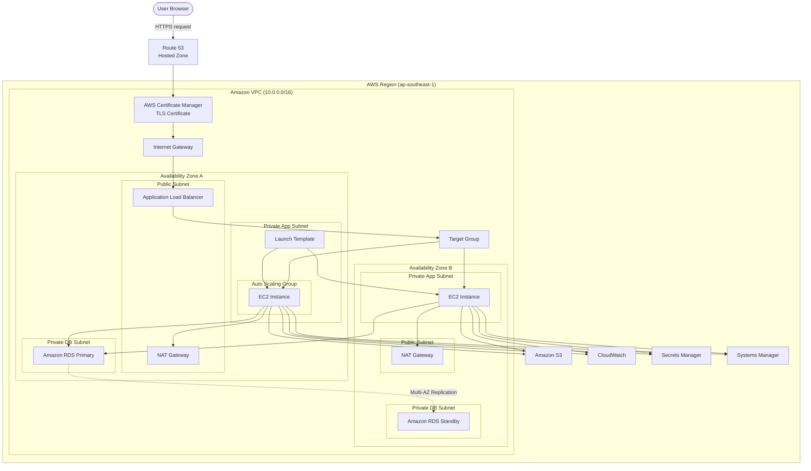

# Enterprise Web Application Platform on AWS

Production-grade highly available web application platform built on Amazon Web Services (AWS).

This project demonstrates how to design and deploy a secure, scalable, and highly available three-tier web application architecture following AWS Well-Architected Framework best practices.

---

## Architecture Overview



---

## Architecture Flow

1. User accesses **https://company.com**
2. Route 53 resolves the domain to the Application Load Balancer.
3. AWS Certificate Manager provides the TLS certificate for HTTPS.
4. Application Load Balancer receives incoming traffic.
5. Target Group forwards the request to a healthy EC2 instance.
6. The application processes the request.
7. Application retrieves database credentials from AWS Secrets Manager.
8. Application reads or writes data to Amazon RDS.
9. User uploaded files are stored inside Amazon S3.
10. Logs and metrics are sent to Amazon CloudWatch.
11. Auto Scaling Group automatically adds or removes EC2 instances based on workload.

---

# AWS Services

| Service | Purpose |
|----------|---------|
| Amazon VPC | Private virtual network |
| Public Subnet | Internet-facing resources |
| Private App Subnet | EC2 Application Layer |
| Private DB Subnet | Database Layer |
| Internet Gateway | Internet access |
| NAT Gateway | Outbound Internet for private resources |
| Security Group | Stateful firewall |
| IAM Role | Secure AWS permissions |
| EC2 | Application Server |
| Launch Template | EC2 configuration template |
| Auto Scaling Group | Automatic horizontal scaling |
| Application Load Balancer | Layer 7 Load Balancer |
| Target Group | Health check & routing |
| Amazon RDS | Managed relational database |
| Amazon S3 | Object storage |
| Route 53 | Managed DNS |
| AWS Certificate Manager | SSL/TLS certificate |
| CloudWatch | Monitoring & Logging |
| Secrets Manager | Secure secret storage |
| Systems Manager | Secure EC2 management |

---

# High Availability

This architecture is designed for high availability.

- Multi Availability Zone deployment
- Application Load Balancer
- Auto Scaling Group
- Multi-AZ Amazon RDS
- Stateless application servers
- Automatic health checks
- Automatic failover

---

# Security Design

- Private EC2 instances
- Private Amazon RDS
- Least Privilege IAM
- Security Group segmentation
- HTTPS everywhere
- Database credentials stored in AWS Secrets Manager
- EC2 managed using Systems Manager (No SSH)

---

# Scalability

Horizontal scaling is implemented using:

- Launch Template
- Auto Scaling Group
- Application Load Balancer

Example:

2 EC2 instances
↓

CPU > 70%

↓

Auto Scaling launches additional EC2

↓

ALB automatically distributes traffic

---

# Monitoring

Amazon CloudWatch monitors:

- CPU
- Memory
- Disk
- Network
- Application Logs
- HTTP Errors
- Custom Metrics

CloudWatch Alarms can trigger Amazon SNS notifications.

---

# Project Structure

```
terraform/
│
├── modules/
│   ├── networking/
│   ├── security/
│   ├── ec2/
│   ├── alb/
│   ├── rds/
│   ├── s3/
│   ├── monitoring/
│   └── iam/
│
├── environments/
│   ├── dev/
│   └── prod/
│
└── main.tf
```

---

# Learning Objectives

This project demonstrates practical experience with:

- AWS Networking
- Cloud Security
- High Availability
- Infrastructure as Code
- Autoscaling
- Load Balancing
- Managed Database
- DNS
- TLS
- Monitoring
- IAM
- AWS Best Practices

---

# Future Improvements

- AWS WAF
- CloudFront CDN
- AWS Backup
- CloudTrail
- GuardDuty
- AWS Config
- Inspector
- ECR
- ECS / EKS Migration
- CI/CD Pipeline
- Blue/Green Deployment
- Multi-Region Disaster Recovery

---

# AWS Well-Architected Pillars

- Operational Excellence
- Security
- Reliability
- Performance Efficiency
- Cost Optimization
- Sustainability

---

# License

MIT
